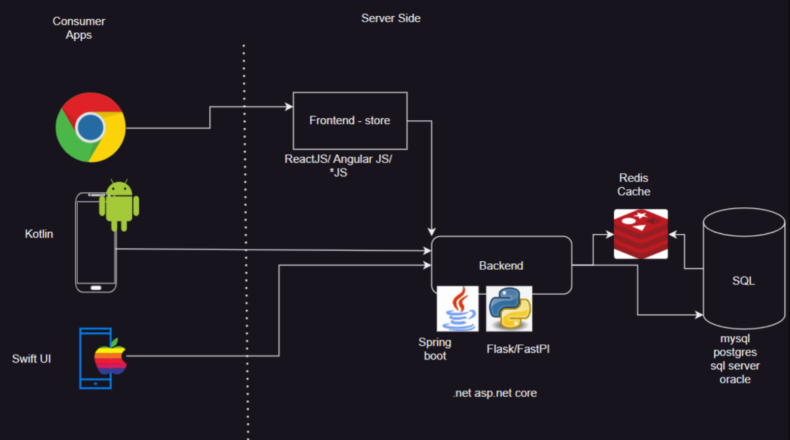

# ePickle Application
* Initial System Design
  

* Here we have the server which is currently hosting the ePickle application and the database on it.
* The Consumer accessnig the aapplication with
    1. Browser
    2. Android App    
    3. IOS App
* When consumer accessing the application through the App they get directly access the backend of the application and from there the application and the contenet of the application gets loaded.
  * Banckend developed in the Spring Boot, Flask / FastAPI
* But when any consumer accessing the application therough the browser they are accssing the front-store of the application and the frontend-store communicate with the backend.
  * Frontend-store developed in any JS technology (ReactJS, AngularJS)
  * For developing the Mobile based application we can use the Kotlin (Android) and Swift UI (IOS)
* Here we are using the SQL databae to store the application content

## Problem - Number of users or request incresed with amount of time to show the post is more
* This is impacting on the application i.e. it will take more time to load the data form the SQL database and displyed to the consumer

## Solution :
* For this adding the Cache data (Redis Cache) our service to read in frequently changed data (static data) from RAM rather than hard disk.
